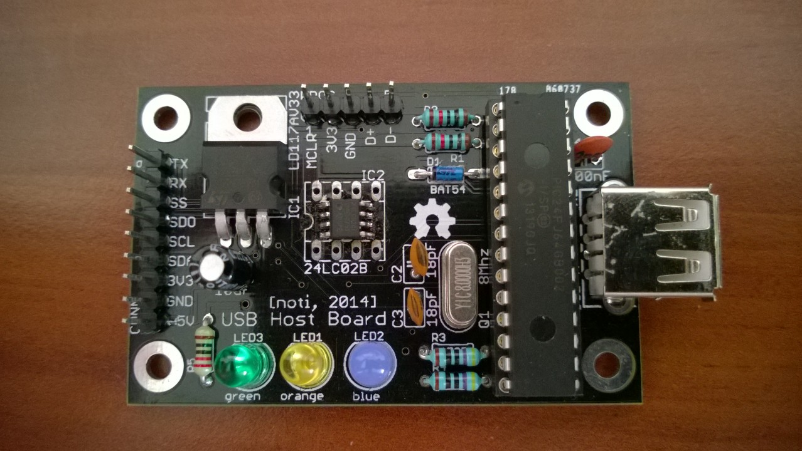

#USB host for Arduino

A PCB for HobbyTronics' USB host board:  [http://www.hobbytronics.co.uk/usb-host-board-v2](http://www.hobbytronics.co.uk/usb-host-board-v2)

*Please note, this design is based on an earlier version of the schematic, thus lacks a few features, like the reset button!*

##Pictures
Assembled:

